# Web3 blog demo

English | [中文](./docs/README_CN.md)

This is a Web3 Blog dApp demo, developed with Next.js for frontend, EVM-compatible smart contract for backend, IPFS for media data store.

What it looks like:
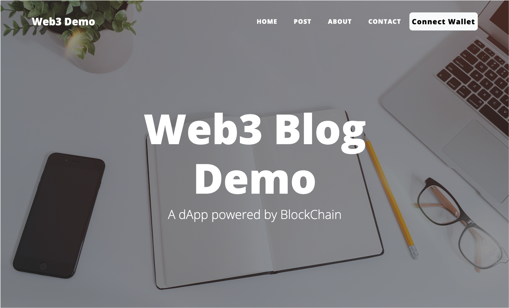

## 1. Prerequisites

<details>
<summary>1) Install Wallet plugin into your browser, such as MetaMask for <a href='https://microsoftedge.microsoft.com/addons/detail/metamask/ejbalbakoplchlghecdalmeeeajnimhm'>MS Edge</a>, and <a href='https://chrome.google.com/webstore/detail/metamask/nkbihfbeogaeaoehlefnkodbefgpgknn'>Chrome</a>. </summary>

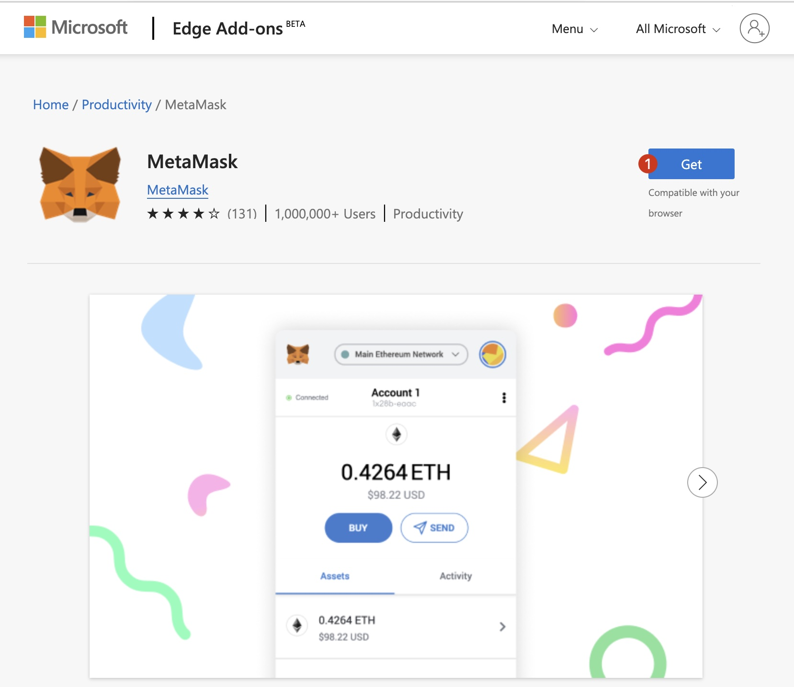
</details>

<details>
<summary>2) Create or import your Ethereum account into wallet.</summary>

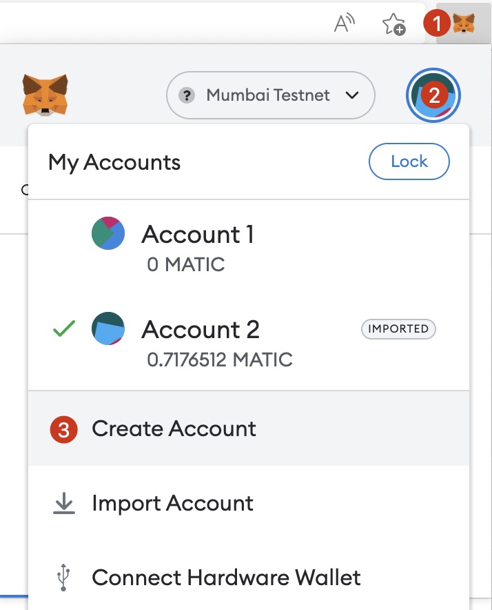

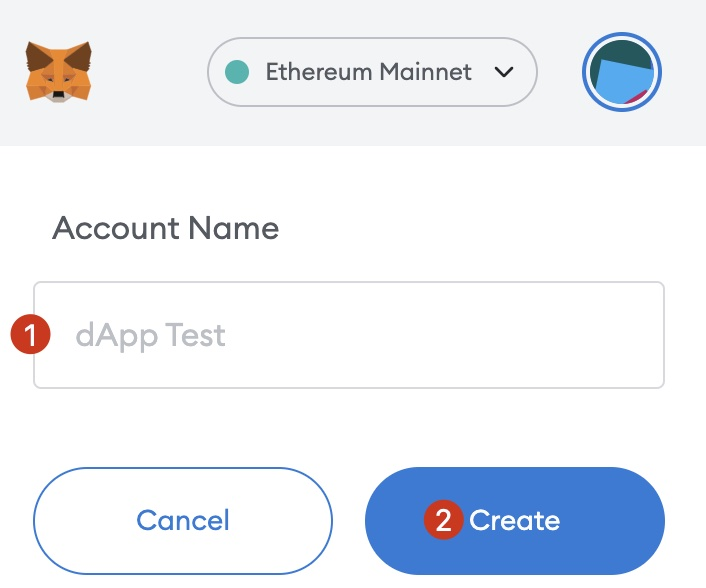
</details>

<details>
<summary>3) Add Polygon Mumbai Testnet into wallet.</summary>

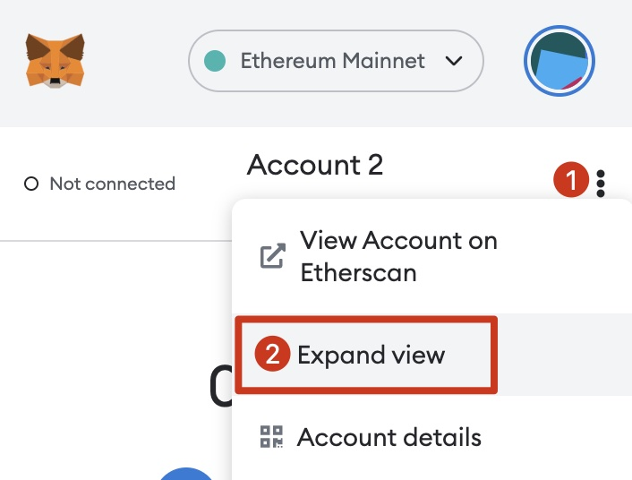

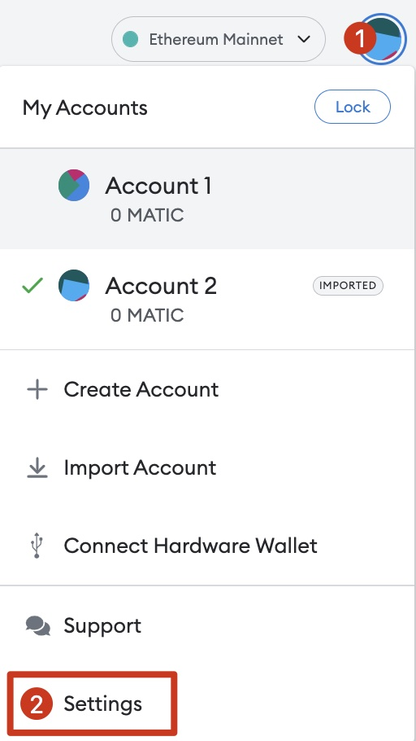

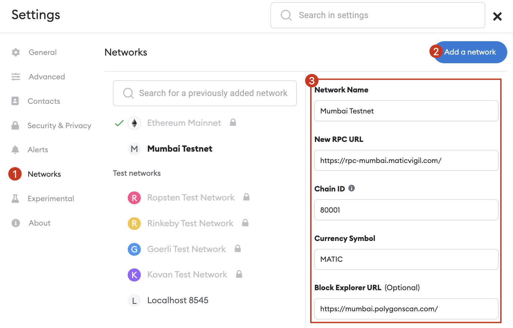

**Metamask Network Parameters**
```
Network Name: Mumbai Testnet
New RPC URL: https://rpc-mumbai.maticvigil.com
Chain ID: 80001
Currency Symbol: MATIC
Block Explorer URL: https://mumbai.polygonscan.com/
```
</details>

<details>
<summary>4) Switch to Mumbai Testnet.</summary>


</details>

<details>
<summary>5) Export private key<a id='5-export-pk'></a></summary>

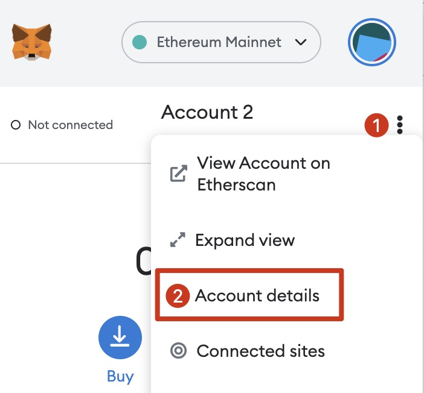

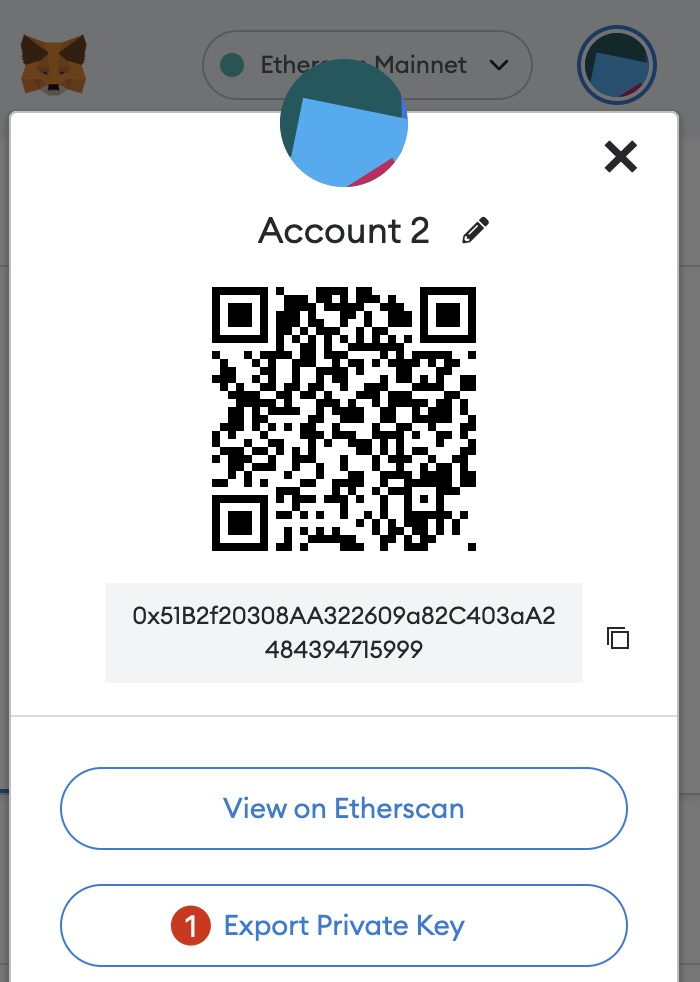

Note down the private key, and keep it secret. We'll use it in following step.
</details>

<details>
<summary>6) Get some MATICs from faucet(it's free and this token has no values), so that you can pay the transaction fees</summary>

Use <a href='https://mumbaifaucet.com/'>Alchemy’s Mumbai faucet:</a>

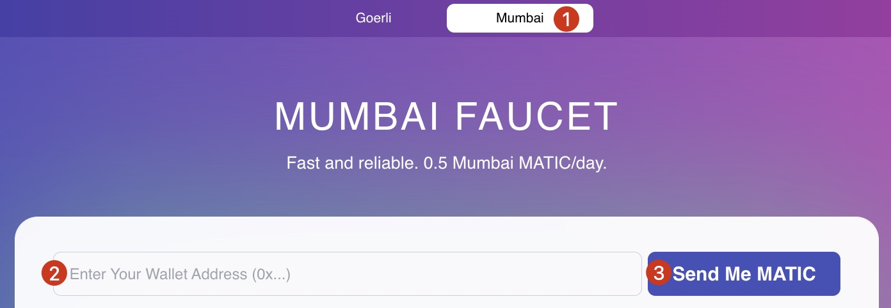

or <a href='https://faucet.polygon.technology/'>Polygon Faucet</a>:

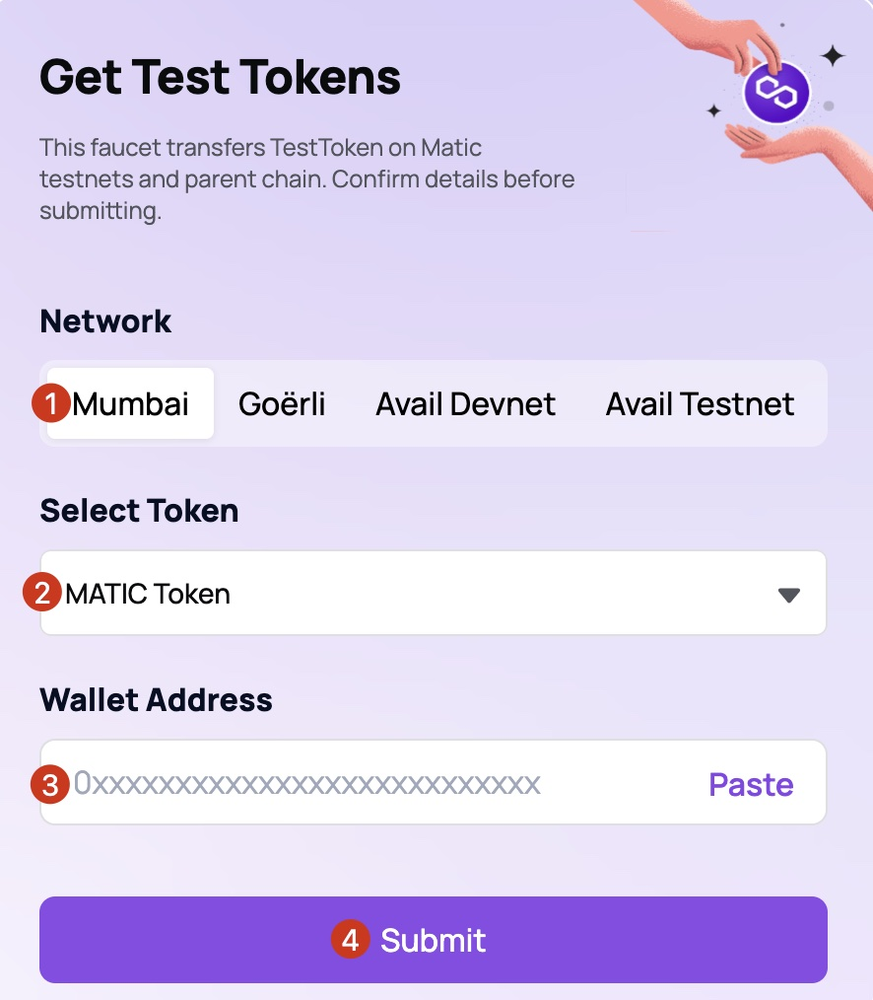
</details>

## 2. One-click IPFS node setup template

In this demo, we'll use the decentralized file storage service, IPFS, to store media files, in order to get better user experience for end-users, we can setup our own IPFS service instead of using public service provider's.

Here we provide a AWS CloudFormation template to help launch a single IPFS node on AWS EC2, so that you can setup IPFS service with several clicks, rather than dive into IPFS deployment details.

The IPFS kubo version included in the template is 0.16.0, you may change the template file and upgrade to newer version if needed.

**WARN 1**: The IPFS node created using this template is open to public and for short-time test purpose only, you can modify its security group to limit access only from your own IP, check this [doc](https://docs.aws.amazon.com/AWSEC2/latest/UserGuide/working-with-security-groups.html#updating-security-group-rules) for more information.

**WARN 2**: The EC2 instance and related resources may incur cost of your AWS account.

### 1) Architecture
In this template, we'll create a VPC with Subnets, the EC2 instance is placed in a Public Subnet and assigned with a public IP address automatically.

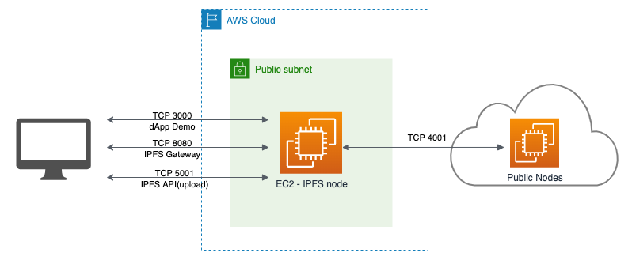

**The OS of this IPFS EC2 instance is Ubuntu 20.04 with default user ubuntu.**

### 2) Default security group rules
| Port | Allowed Source | Description
| - | - | -
| TCP 22 | 0.0.0.0/0 | SSH
| TCP 3000 | 0.0.0.0/0 | Node.js backend server
| TCP 4001 | 0.0.0.0/0 | IPFS p2p network
| TCP 5001 | 0.0.0.0/0 | IPFS API endpoint
| TCP 8080 | 0.0.0.0/0 | IPFS Gateway endpoint

### 3) Deploy template

#### Create or import EC2 Key Pair

If any key pairs exist in the Region you want to deploy the template, and you have its private key, you can skip this step and goto depolyment options.

Otherwise, please follow the [document](https://docs.aws.amazon.com/AWSEC2/latest/UserGuide/create-key-pairs.html) to create or import an existing key pair.

#### Option 1 - China Regions

Click to setup IPFS instance in AWS China Region. You can use default settings in CloudFormation console.

[](https://console.amazonaws.cn/cloudformation/home?#/stacks/create/review?templateURL=https://workshop-binc.s3.cn-northwest-1.amazonaws.com.cn/web3-demo/ipfs-single-node-template.yaml&stackName=ipfs-node) 

#### Option 2 - Global Regions
Click to setup IPFS instance in AWS Global Region. You can use default settings in CloudFormation console.

[](https://console.aws.amazon.com/cloudformation/home?#/stacks/create/review?templateURL=https://workshop-binc.s3.cn-northwest-1.amazonaws.com.cn/web3-demo/ipfs-single-node-template.yaml&stackName=ipfs-node)

### 5) CloudFormation outputs

In the CloudFormation Console, navigate to the Outputs tab and note down the ApiEndpoint, GatewayEndpoint and WebUI urls, we'll use them in following steps.


## 3. Steps to run this demo

You may deploy this demo into the EC2 instance created in last step, or into your local computer, we'll choice the prior method.

You can use SSH command to connect to your EC2 instance:

```bash
ssh -i path/to/your-key-pair.pem ubuntu@ec2.instance.public.ip
```

Or use [Session Manager](https://docs.aws.amazon.com/systems-manager/latest/userguide/session-manager.html) from AWS System Manager.

We'll use *ubuntu* user to execute commands in all the following steps.

### 1) Install Node.js v16

We'll use [nvm.sh](https://github.com/nvm-sh/nvm/blob/master/README.md#installing-and-updating) to install nodejs env.

```bash
# This installs nvm into ~/.nvm
curl -o- https://raw.githubusercontent.com/creationix/nvm/master/install.sh | bash

# This loads nvm
source ~/.profile

# This installs nodejs version 16.17
nvm install 16.17 
```

### 2) Upload an image to IPFS

In our demo, a cover image is used as our homepage's background, this image is saved in IPFS network. The [cid](https://docs.ipfs.tech/concepts/content-addressing/#what-is-a-cid) of this image will be stored in the Blog smart contract.

There’re handful tools can be used to upload image file to IPFS, such as IPFS CLI, IPFS Desktop app and so on. Here we'll use the IPFS WebUI, you can find the WebUI URL in [CloudFormation outputs](#5-cloudformation-outputs) section. Open this URL in a new browser tab, here's what it looks like:

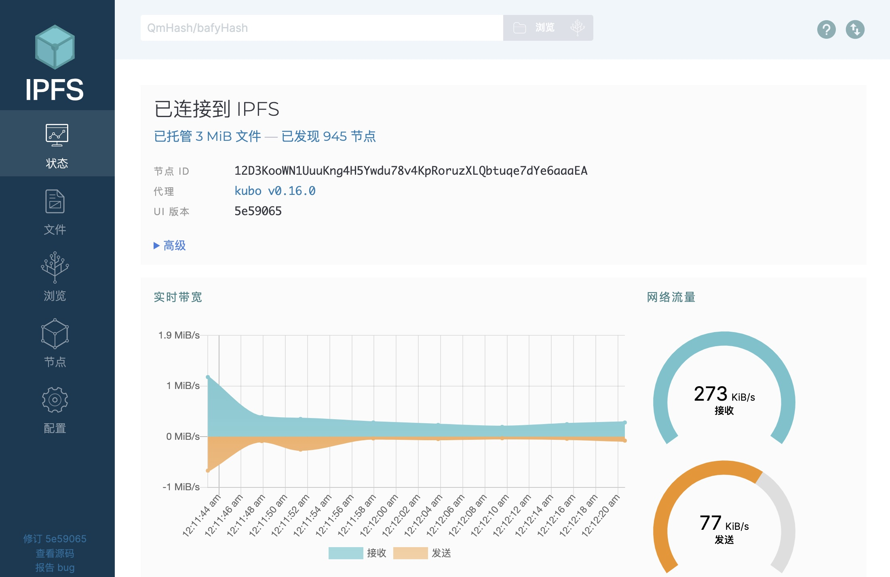

In the Files tab, import a image file you like, and note down the cid, i.e. *QmfSZ...zAqW* in this screenshot.
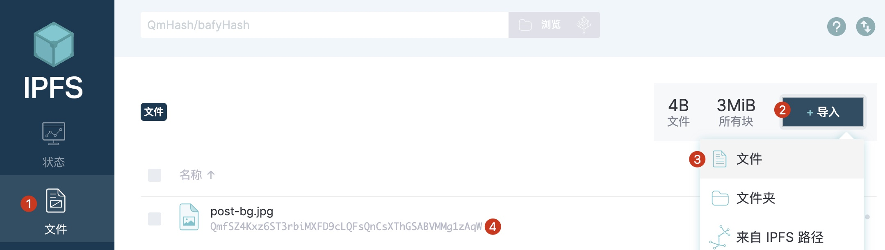

### 3) Download source code

Login to your IPFS EC2 instance and clone source code.

```bash
git clone https://github.com/Chen188/web3-dApp-demo && cd web3-dApp-demo && npm ci
```

### 4) Edit local environment file

```bash
cp .env.testnet .env.local
```
Edit *.env.local*:

- Set value of *NEXT_PUBLIC_ipfs_gateway* and *NEXT_PUBLIC_ipfs_uri* with the outputs in section [CloudFormation outputs](#5-cloudformation-outputs), or use public IPFS service such as [Infura](https://infura.io/). For example:

    ```
    NEXT_PUBLIC_ipfs_api=http://1.2.3.4:5001/api/v0
    NEXT_PUBLIC_ipfs_gateway=http://1.2.3.4:8080/ipfs/
    ```
- If you're using Infura IPFS service, you can set *NEXT_PUBLIC_ipfs_auth_user* with your Infura IPFS project id, and *NEXT_PUBLIC_ipfs_auth_password* with Infura IPFS project secret.

### 5) Edit the smart contract deployment script

Edit the `./scripts/deploy.js` with your prefered editor, replace *QmeisUNzsWHmjmD8hX3mGsC8sYiYYwx2Qif98bHJPBvQsG* with the cid in section [Upload an image to IPFS](#2-upload-an-image-to-ipfs), save & close this file.

### 6) Deploy the smart contract

Get the private key in step <a href='5-export-pk'>export private key</a>, and run the Shell script:

```bash
# this will deploy Blog Contract into the address corresponding to pk
privateKey=REPLACE-WITH-YOUR-PRIVATE-KEY
pk=$privateKey npx hardhat run scripts/deploy.js

>>example output<<
Downloading compiler 0.8.4
Compiled 3 Solidity files successfully
Blog deployed to: 0x6666666666666666666688888888888888888888
```

### 7) Build and run
1. Run `npm run build && npm run start`
    
    ```bash
    % npm run build && npm run start

    > web3-blog-demo@0.1.0 build
    > next build

    info  - Loaded env from /Users/binc/ror/nextjs-blog/.env.local
    info  - Linting and checking validity of types  
    info  - Creating an optimized production build  
    info  - Compiled successfully
    ...
    ready - started server on 0.0.0.0:3000, url: http://localhost:3000
    info  - Loaded env from /Users/binc/ror/nextjs-blog/.env.local
    ```
1. Open http://<your.ec2.public.ip>:3000 in your browser