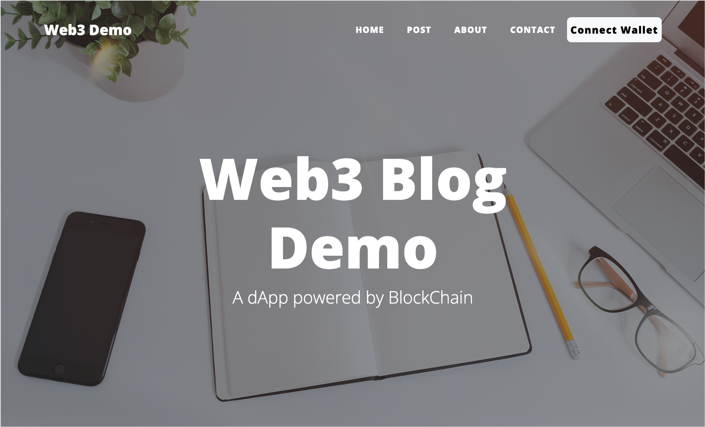
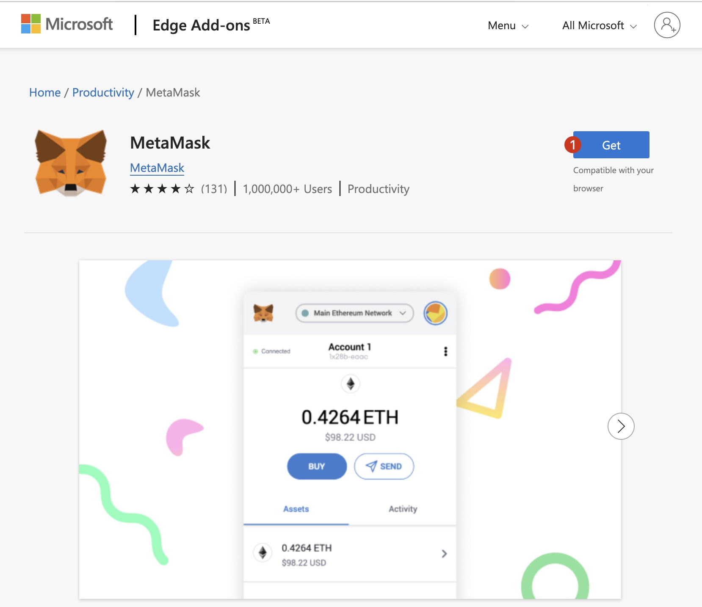
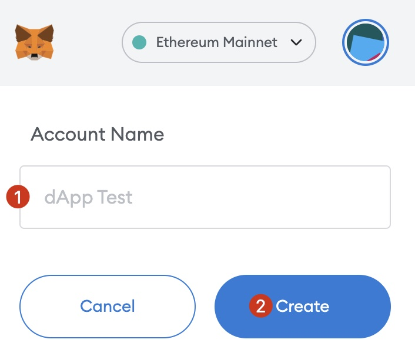
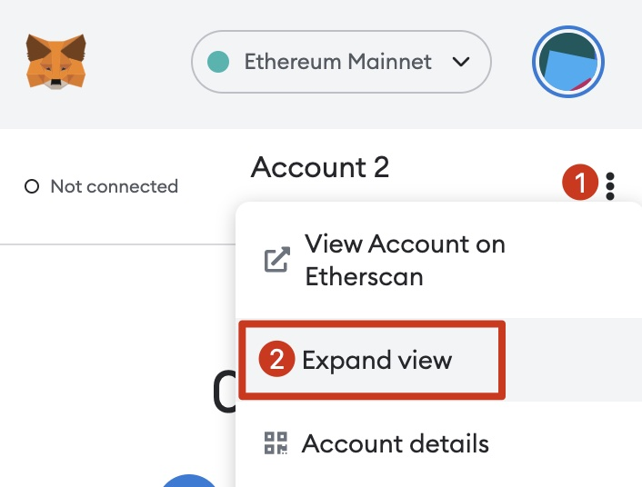
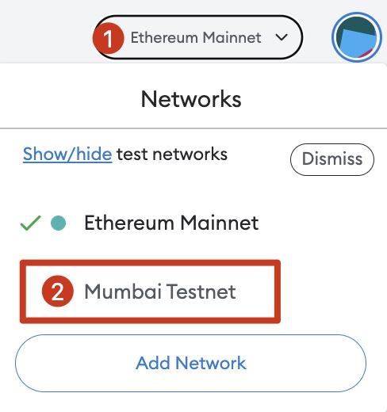
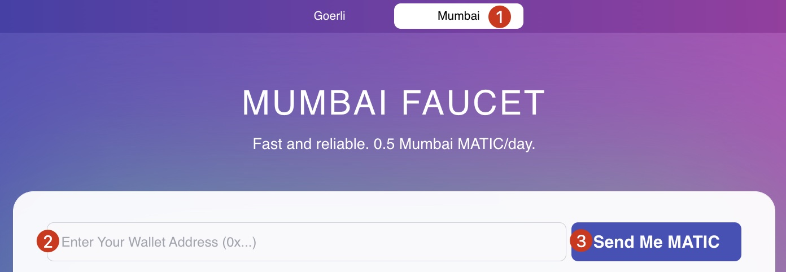
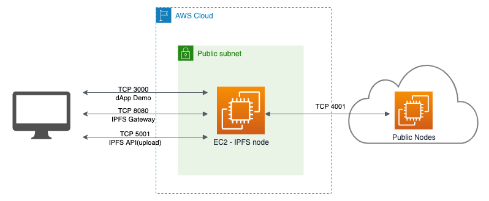
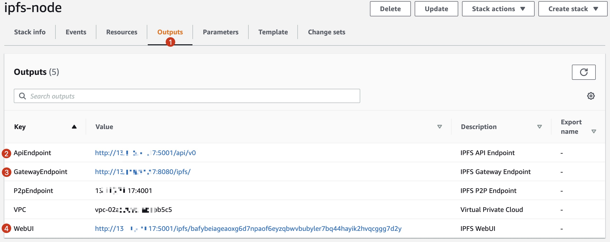

# Web3 blog demo

[English](../README.md) | 中文

这里我们提供了一个Web3 博客 dApp demo，采用Next.js实现前端功能，Solidity 作为智能合约开发语言（支持EVM及EVM兼容链），同时，我们会把博客数据及博客中的多媒体文件存放在IPFS网络中。

此Demo运行起来之后的效果如图：


## 1. 准备工作

<details>
<summary>1) 安装钱包插件到浏览器中，如 MetaMask <a href='https://microsoftedge.microsoft.com/addons/detail/metamask/ejbalbakoplchlghecdalmeeeajnimhm'>MS Edge</a> 浏览器 或者 <a href='https://chrome.google.com/webstore/detail/metamask/nkbihfbeogaeaoehlefnkodbefgpgknn'>Chrome</a> 浏览器 </summary>


</details>

<details>
<summary>2) 创建或导入一个 Ethereum 账户到钱包中</summary>



</details>

<details>
<summary>3) 添加 Polygon Mumbai 测试网络到钱包</summary>




**Metamask Network Parameters**
```
Network Name: Mumbai Testnet
New RPC URL: https://rpc-mumbai.maticvigil.com
Chain ID: 80001
Currency Symbol: MATIC
Block Explorer URL: https://polygonscan.com/
```
</details>

<details>
<summary>4) 切换到 Mumbai 测试网</summary>


</details>

<details>
<summary>5) 导出私钥<a id='5-export-pk'></a></summary>


将私钥保存下来，我们会在后续的步骤中使用到。
</details>

<details>
<summary>6) 从水龙头免费获得一些 MATICs (这些测试Token没有任何价值), 仅用于支付测试网中的交易手续费</summary>

如 <a href='https://mumbaifaucet.com/'>Alchemy’s Mumbai</a>：



或者 <a href='https://faucet.polygon.technology/'>这里</a>：


</details>

## 2. 使用模板一键部署IPFS节点

这个Demo里，我们使用去中心化的文件存储IPFS，来存储媒体及博客本身的内容数据。为了有更好的访问速度，我们建议创建一个自己的IPFS节点，当然，您也可以使用第三方的IPFS服务商。

为了方便大家快速创建自己的IPFS节点，我们提供了一个AWS CloudFormation的模板。您只需要点几下鼠标就可以完成节点的搭建，无需研究具体的节点搭建手册。

模板中使用的是 IPFS kubo 0.16.0，您也可以按照需求修改模板，以使用最新的软件版本。

**注意 1**: 使用此模板创建的IPFS节点是对全世界开放的、且仅建议用来做测试用。您可以在AWS控制台修改安全组，来实现对访问来源的限制（如只允许自己的IP访问该节点），更多有关安全组的信息，请参考[这里](https://docs.aws.amazon.com/AWSEC2/latest/UserGuide/working-with-security-groups.html#updating-security-group-rules).

**注意 2**: 模板中创建的EC2实例及相关资源可能会给您的AWS账户带来费用，请在完成实验后及时清理。

### 1) 架构

此模板会帮我们自动创建一个包含多个子网的VPC，IPFS 的EC2实例会被放在一个公有子网中，并自动获得一个公网IP。其架构如下：



**IPFS EC2 实例采用的是 Ubuntu 20.04 操作系统，默认用户名是 ubuntu 。**

### 2) 默认安全组规则
| 端口 | 允许的来源 | 描述
| - | - | -
| TCP 22 | 0.0.0.0/0 | SSH
| TCP 3000 | 0.0.0.0/0 | Node.js 后端服务器
| TCP 4001 | 0.0.0.0/0 | IPFS p2p 网络
| TCP 5001 | 0.0.0.0/0 | IPFS API 接口
| TCP 8080 | 0.0.0.0/0 | IPFS Gateway 接口

### 3) 部署模板

#### 创建或导入 EC2 密钥对

如果您计划部署模板的区域中已经存在 EC2 密钥对，并且您拥有对应私钥的访问权，则可以直接进入部署选项步骤。

如果您计划部署模板的区域中没有 EC2 密钥对或者想要使用一个新的密钥对，则可以按照 [文档](https://docs.aws.amazon.com/AWSEC2/latest/UserGuide/create-key-pairs.html) 导入已有密钥对或者创建一个新的。

#### 部署选项 1 - 中国区

点击如下图标以在中国区创建节点，您可以使用默认配置。

[](https://console.amazonaws.cn/cloudformation/home?#/stacks/create/review?templateURL=https://workshop-binc.s3.cn-northwest-1.amazonaws.com.cn/web3-demo/ipfs-single-node-template.yaml&stackName=ipfs-node) 

#### 部署选项 2 - 海外区域

点击如下图标以在海外区创建节点，您可以使用默认配置。

[](https://console.aws.amazon.com/cloudformation/home?#/stacks/create/review?templateURL=https://workshop-binc.s3.cn-northwest-1.amazonaws.com.cn/web3-demo/ipfs-single-node-template.yaml&stackName=ipfs-node)

### 4) CloudFormation 的输出<a id='cloudformation-outputs'></a>

在CloudFormation控制台，您可以打开输出页，并记录下ApiEndpoint, GatewayEndpoint and WebUI的链接，后续的步骤中我们会使用到。



## 3. 运行此Demo的步骤

您可以选择将代码部署到上一步所创建的EC2中，也可以部署到自己本地电脑，我们这里选择的是EC2服务器。

您可以使用SSH远程访问EC2实例：

```bash
ssh -i path/to/your-key-pair.pem ubuntu@ec2.instance.public.ip
```

或者使用 AWS System Manager 中的 [Session Manager](https://docs.aws.amazon.com/systems-manager/latest/userguide/session-manager.html) 功能。

### 1) 安装 Node.js v16

我们会使用 [nvm.sh](https://github.com/nvm-sh/nvm/blob/master/README.md#installing-and-updating) 来配置Node的环境。

```bash
# This installs nvm into ~/.nvm
curl -o- https://raw.githubusercontent.com/creationix/nvm/master/install.sh | bash

# This loads nvm
source ~/.profile

# This installs nodejs version 16.17
nvm install 16.17 
```

### 2) 上传一张图片到 IPFS<a id='2-upload-an-image-to-ipfs'></a>

我们Demo中会包含一张封面图片作为首页的背景，这张图片是存放在IPFS网络中。其 [cid](https://docs.ipfs.tech/concepts/content-addressing/#what-is-a-cid) 会被记录在智能合约中。

要上传文件到IPFS网络，我们可以有很多选择，如IPFS CLI, IPFS 桌面客户端等。这里，我们使用的是IPFS WebUI, 您可以在 [CloudFormation 输出](#cloudformation-outputs) 中找到具体的URL，打开此链接，您可以看到类似下图的界面：


在文件页，导入一张图片并记录下cid，如截图中所示的 *QmfSZ...zAqW* 部分。


### 3) 下载源码

SSH登录到EC2服务器中，并clone代码：

```bash
git clone https://github.com/Chen188/web3-dApp-demo && cd web3-dApp-demo && npm install
```

### 4) 编辑环境变量

```bash
cp .env.testnet .env.local
```
编辑 *.env.local*:

- 将 *NEXT_PUBLIC_ipfs_gateway* 及 *NEXT_PUBLIC_ipfs_uri* 替换为 [CloudFormation 输出](#cloudformation-outputs) 页的值, 或者使用第三方的IPFS服务，如 [Infura](https://infura.io/). 修改后的格式如:

    ```
    NEXT_PUBLIC_ipfs_api=http://1.2.3.4:5001/api/v0
    NEXT_PUBLIC_ipfs_gateway=http://1.2.3.4:8080/ipfs/
    ```
- 如果您使用的是 Infura 提供的 IPFS服务, 您可以将 *NEXT_PUBLIC_ipfs_auth_user* 的值设置为项目id, 将 *NEXT_PUBLIC_ipfs_auth_password* 设置为项目的密钥。

### 5) 编辑智能合约部署脚本

使用您熟悉的编辑器打开 `./scripts/deploy.js`, 将 *QmeisUNzsWHmjmD8hX3mGsC8sYiYYwx2Qif98bHJPBvQsG* 替换为 [上传图片到 IPFS](#2-upload-an-image-to-ipfs) 章节中的cid.

### 6) 部署智能合约

这里我们需要将 `pk` 替换为步骤 <a href='5-export-pk'>导出私钥</a> 中的私钥.

```bash
# this will deploy Blog Contract into the address corresponding to pk.
pk=<replace-with-your-private-key> npx hardhat run scripts/deploy.js

>>示例输出<<
Downloading compiler 0.8.4
Compiled 3 Solidity files successfully
Blog deployed to: 0x6666666666666666666688888888888888888888
```

### 7) 编译&启动Web服务
1. 执行 `npm run build && npm run start`
    
    ```bash
    % npm run build && npm run start

    > web3-blog-demo@0.1.0 build
    > next build

    info  - Loaded env from /Users/binc/ror/nextjs-blog/.env.local
    info  - Linting and checking validity of types  
    info  - Creating an optimized production build  
    info  - Compiled successfully
    ...
    ready - started server on 0.0.0.0:3000, url: http://localhost:3000
    info  - Loaded env from /Users/binc/ror/nextjs-blog/.env.local
    ```
1. 在浏览器中打开 http://<your.ec2.public.ip>:3000
